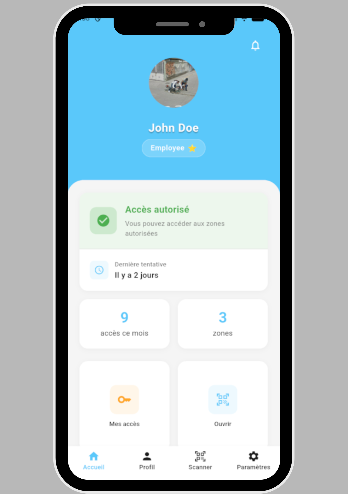
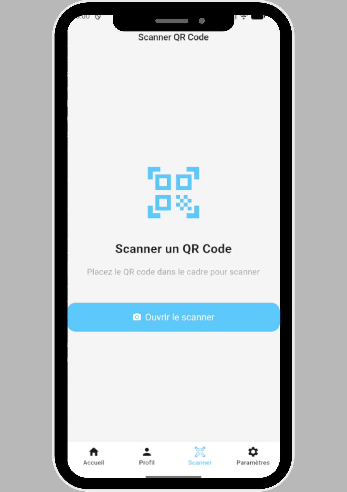
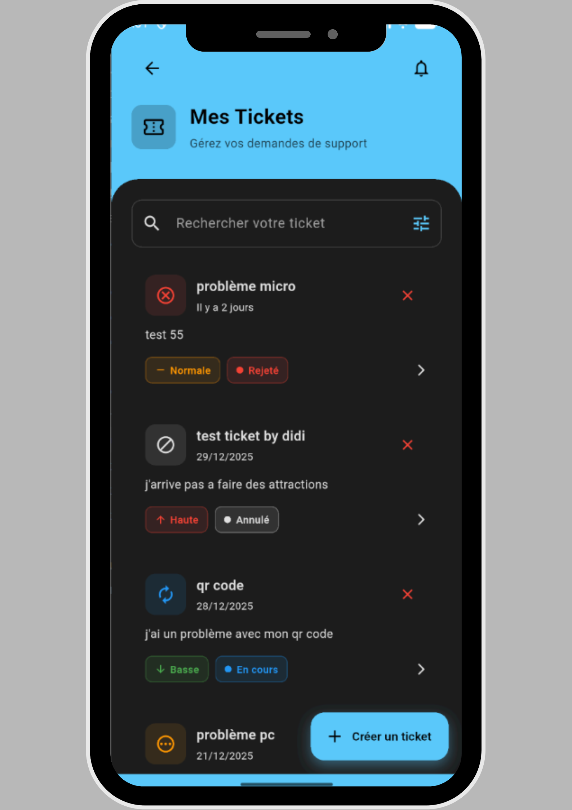
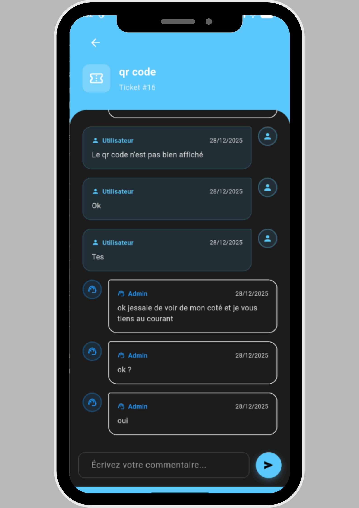
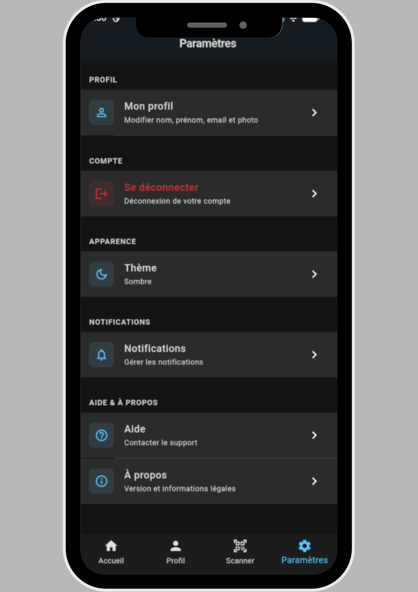

# Mobile – Platine Qcess

## Stack
- Flutter
- Dart
- Cible : Android (APK), iOS, Web, Desktop (support framework)
- Intégration avec le backend via :
	- API REST (`API_BASE_URL`)
	- WebSocket/STOMP (`WS_BASE_URL` via SockJS)

## 📸 Aperçu

| Espace utilisateur | Scan QR | Tickets | Détails ticket | Paramètres |
|:---:|:---:|:---:|:---:|:---:|
|  |  |  |  |  |

## Architecture applicative
- Architecture **feature-first** (par domaine fonctionnel) :
	- `features/auth`, `features/home`, `features/profile`, `features/maintenance`, `features/notification`, `features/access`, etc.
- Gestion d’état : BLoC (`flutter_bloc`)
- Injection de dépendances via `get_it` (voir `lib/core/di/di.dart`)
- Réseau : `dio` + interceptors (auth, log, gestion d’erreurs)
- WebSocket : `stomp_dart_client` + `SocketService`

## Lancer l’app en développement

Depuis le dossier `mobile/` :

```bash
flutter pub get

flutter run \
	--dart-define=API_BASE_URL=http://10.0.2.2:8080 \
	--dart-define=WS_BASE_URL=http://10.0.2.2:8080/ws
```

Pour un vrai téléphone sur le même réseau que le backend, remplacer l’IP par l’adresse locale de la machine backend (ex : `http://192.168.x.x:8080`).

Les valeurs par défaut (sans `--dart-define`) sont définies dans `lib/core/di/di.dart`.

## 📦 Build APK

Depuis `mobile/` :

```bash
# Build APK release avec URLs explicites
flutter build apk --release \
	--dart-define=API_BASE_URL=http://<IP_BACKEND>:8080 \
	--dart-define=WS_BASE_URL=http://<IP_BACKEND>:8080/ws
```

L’APK généré se trouve dans :

- `build/app/outputs/flutter-apk/app-release.apk`

## Tests

```bash
flutter test
```

## Points d’intégration
- **Backend** :
	- `apiBaseUrl` et `websocketUrl` configurés dans `lib/core/di/di.dart`
- **Notifications** :
    - Firebase Cloud Messaging (FCM) pour les notifications push
	- Gestion du token de device dans `features/notification`
